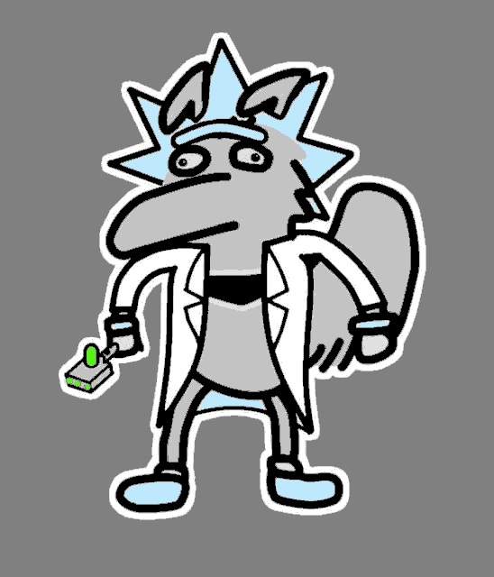
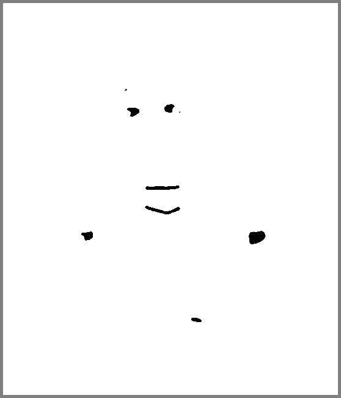

# IMG2STL

 

   
  <b>Physical 3D Prints from the STLs created using IMG2STL. Looks good!</b> 

This project solves a 3D printing problem. If I want to 3D print an image, each color in the image must be a separate STL. I own a Prusa MK3S MMU2S 3D printer which can print in 5 colors. So my image must be simplified to a set number of colors. (which this program performs). Then each color is masked to be its own image which can be uploaded to Selva3D to produce the STL for that color (or the native stl_tools library can produce the STL directly).

This RGB Image Splicer can do two things:

1. You can convert an image to use a specific color space (ie. only green, black, yellow, etc.) and 
1. You can splice an image such that each color space is a separate B&W image with a grey border. The grey border is added because it prevents Selva3D from resizing each image when converting the image to a STL. See the examples below:

## Notes
- Use PNGs instead of JPEGs. JPEGs compress images and lose image quality. PNGs are uncompressed images.
- In section 3 you can see gaps between the STLs. Selva3D uses its own convolution smoothing on free STL downloads. This reduces the detail of the image drastically which is bad because the STL is not an exact representation of each color.
- This implementation removes salt and pepper from spliced images using a median filter without drastic effects (see Pixels Lost Through Smoothing image). 
- If Black (0,0,0) is one of your chosen colors use (5,5,5) instead. Choosing pure Black messes with PNG images.
- Improvements: Match pixels lost through median filter smoothing to its color relatives (could be done by matching such pixels to closest color that is not its assigned color). Also check how native STLs appear with no smoothing. 

## How To Use Program

cd into the IMG2STL folder
On the command line run:

pip3 install virtualenv # install if not present

virtualenv -p python3 venv # running python 3.7.4 - creating virtual environment

source venv/bin/activate

pip3 install -r requirements.txt # installs necessary libraries

python3 main.py # run program, click crtl+c to quit

deactivate # leave virtual environment once complete with tasks

Additonally, there is a simple web interface created with Flask that you can use. Just execute python3 main.py.

   
  <b>Selector Page</b> 

   
  <b>Results Page</b> 

## 1. Convert Image to Use Color Space

Color Space:
* Black (0,0,0)
* White (255,255,255)
* Grey (195,195,195)
* Blue (190, 233, 252)
* Green (64, 254, 0)
* Background (128,128,128)
* Eyes/Arms (225,225,225)

   
  <b>Original</b> 

   
  <b>After Color Space Conversion</b> 

## 2. Splice Image Such That Each Color Space is a Separate B&W Image with Grey Border
Note: Black is the chosen color. White is the background. Grey is the border.

   
  <b>Black</b> 

   
  <b>White</b> 

   
  <b>Grey</b> 

   
  <b>Blue</b> 

   
  <b>Green</b> 

   
  <b>Background</b> 

   
  <b>Eyes and Arms</b> 

   
  <b>Pixels Lost Through Smoothing</b> 

## 3. Performance on Prusa Slicer

   
  <b>Print Placement from Selva3D STLs</b> 

   
  <b>Print Quality from Selva3D STLs</b> 

   
  <b>Comparison: Selva3D vs stl_tools library</b> 

- Selva3D
  - Pros: Model is smooth, looks nice
  - Cons: Colors are loosely connected, could affect 3D print structure
- stl_tools
  - Pros: Colors are more cohesively connected for a stronger 3D print
  - Cons: Model is rougher, akin to being slightly pixelated

